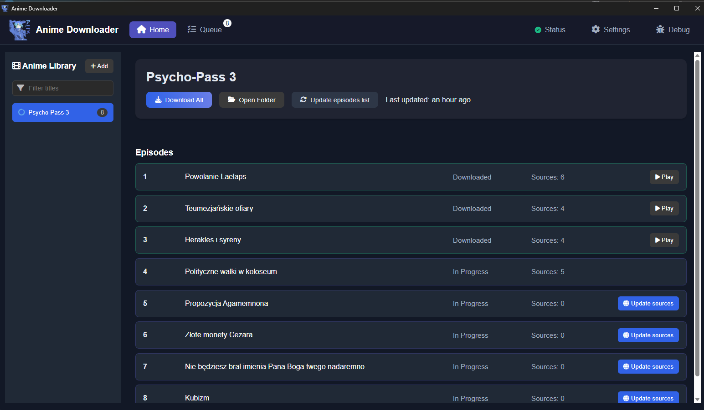
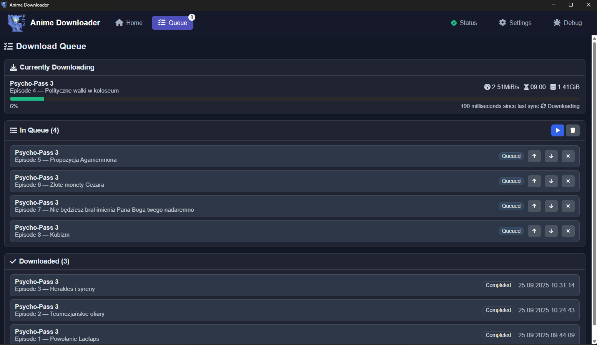

# AnimeVideoDownloader 2.0

Supported sites:
* Shinden.pl

Supported video providers:
- All supported by yt-dlp

History version can be found [here](CHANGELOG.md)

### Usage

1. Download from release page.
2. Run by clicking on `DesktopApp.exe`

### Notes
- App directory can be found at `%AppData%/AnimeDownloader`
- App uses Sqlite from here `%AppData%/AnimeDownloader/anime.db`
- You must have to have Chrome installed

## Bugs
There will be bugs. If you find any, please report it [here](https://github.com/Morasiu/AnimeVideoDownloader/issues)